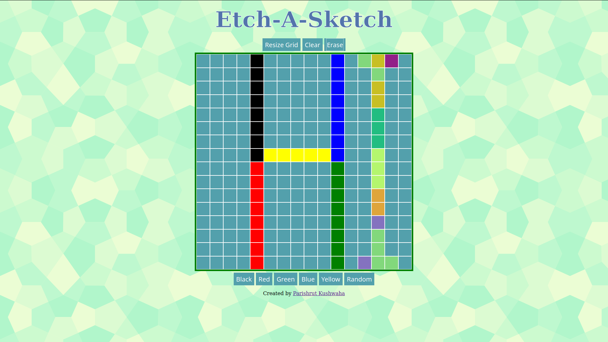

# ETCH-A-SKETCH
[CLICK TO PLAY NOW](https://parish09.github.io/ETCH-A-SKETCH/)  
A browser version of an Etch-A-Sketch.

# Screenshot

# How to use
Draw on the board by moving the mouse to the desired tiles. Improve your design by using the different function buttons.

# Features
- Resize Grid
- Clear
- Erase
- Multicolor

